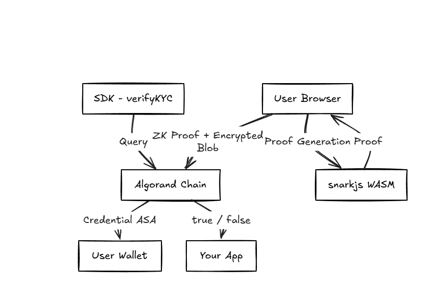

## What is AlgoKYC?

AlgoKYC is an open-source SDK that brings Zero-Knowledge KYC verification to the Algorand blockchain. It allows any developer to add a fully DPDP-compliant KYC widget to their application in three lines of code — without ever storing, transmitting, or touching a user's personal data.

A DeFi lending protocol, a crypto exchange, or any regulated Algorand app can gate access based on KYC status — without seeing a single byte of user identity data.

*   **User proves:** *"I am a KYC-verified Indian adult"*
*   **App receives:** `true / false`
*   **Data stored anywhere:** **zero**

## Why AlgoKYC?

### The KYC Data Crisis

Every regulated app in India — exchanges, DeFi protocols, lending platforms — must verify user identity. The current approach is fundamentally broken:

*   User uploads Aadhaar card, PAN, selfie to each app.
*   Each app stores this data on their own servers.
*   50 apps = 50 copies of your most sensitive identity documents.
*   Each server is a breach waiting to happen — and breaches have happened repeatedly.
*   On-chain KYC is even worse: data becomes public and immutable forever.

**The Root Cause:** The system conflates two separate operations:
`VERIFICATION` — confirming a fact about a person ("they are 18+")
`DISCLOSURE` — revealing the underlying data ("their DOB is 01/01/1995")

Nobody needs the second. Everyone currently demands it anyway.

### The DPDP Act Creates Legal Urgency

India's Digital Personal Data Protection Act (2023) introduces **data minimization** as a core legal principle: collect only what you need, retain only as long as necessary. The current KYC industry violates this principle structurally.

AlgoKYC is the infrastructure that makes compliance technically achievable for Indian fintechs.

## How it works

AlgoKYC uses Zero-Knowledge Proofs to separate verification from disclosure. The user proves a set of mandatory facts about themselves — without revealing the underlying documents — and receives a non-transferable on-chain credential. Any app checks the credential.

<CardGroup cols={2}>
  <Card title="Client-Side Proofs" icon="shield-halved">
    Aadhaar Offline XML is parsed locally. ZK proof generated in browser. Raw data deleted after proof gen. Never leaves device.
  </Card>
  <Card title="Mathematical Verification" icon="square-root-variable">
    Cryptographic proof that user satisfies mandatory KYC requirements. ~200 bytes. Mathematically impossible to reverse.
  </Card>
  <Card title="On-Chain Anchor" icon="link">
    LogicSig verifier validates proof. Nullifier anchored on-chain. Non-transferable credential ASA issued to wallet.
  </Card>
  <Card title="Conditional Anonymity" icon="gavel">
    Encrypted identity package stored in Algorand box storage. Shamir 3/5 threshold decrypts only under court order.
  </Card>
</CardGroup>

## Next Steps

Explore the architecture or jump straight into integrating the SDK.

<CardGroup cols={2}>
  <Card
    title="Architecture & Algorithms"
    icon="diagram-project"
    href="/architecture"
  >
    Deep dive into the PLONK proofs, gnark circuits, and Algorand smart contracts.
  </Card>
  <Card
    title="Integration Guide"
    icon="code"
    href="/integration"
  >
    Add the 3-line React widget and server-side verification to your app.
  </Card>
</CardGroup>
